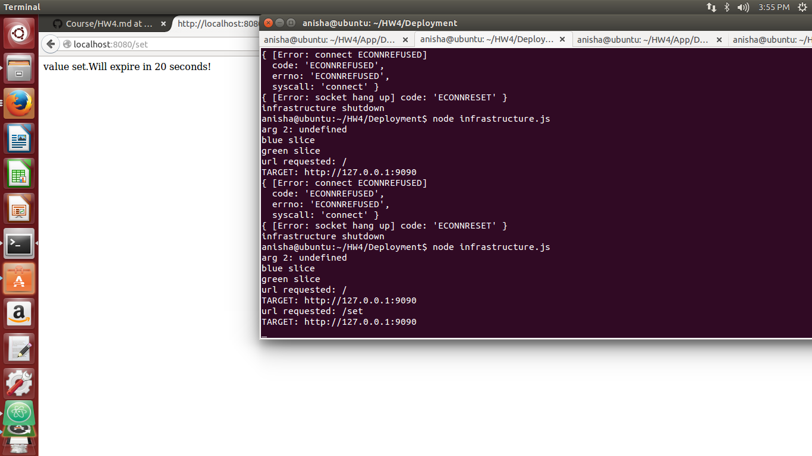
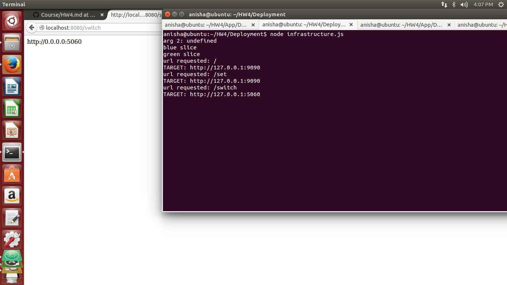
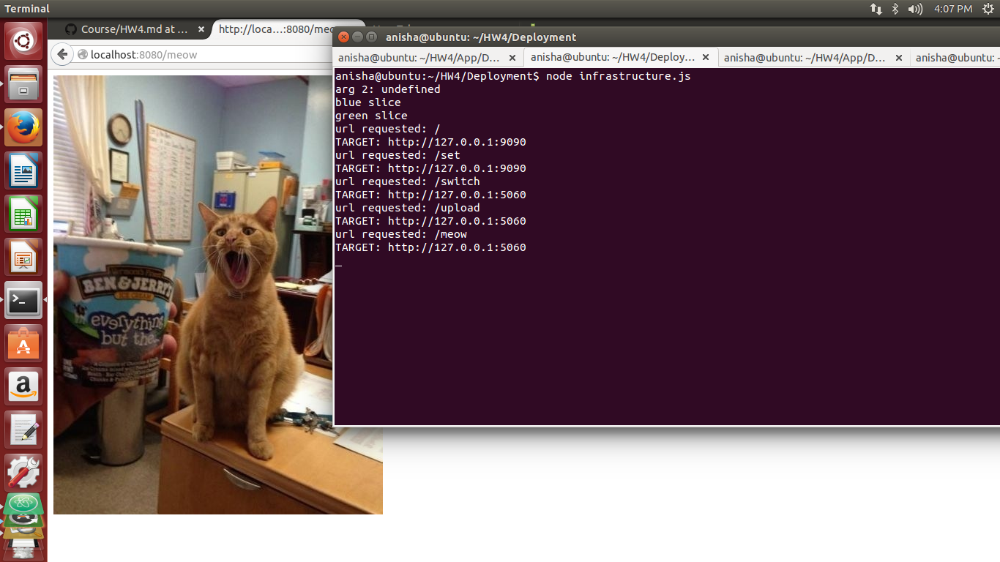

#### Directory Structure:
```
.
├── App
│   └── DevOpsHW3
├── deploy
│   ├── blue.git
│   ├── blue-www
│   ├── green.git
│   └── green-www
├── Deployment
│   ├── infrastructure.js
│   ├── node_modules
│   ├── package.json
│   ├── README.md
│   └── uploads
├── Readme.md

```
App: Within this folder is DevOpsHW3 i.e. the application to be deployed

deploy: This folder contains the blue/green infrastructure .

Deployment : This folder contains the deployment logic(infrastructure.js)

### Rubrics:

##### 1. Complete git/hook setup:
Edited the post-receive hook to set the *-www folders as the working tree for the git.
Below is the post receive hook for the blue infrastructure.

```shell
GIT_WORK_TREE=../blue-www/ git checkout -f
cd ../blue-www/
npm install

```
```
anisha@ubuntu:~/HW4/App/DevOpsHW3$ echo "//sample comment "> main.js
anisha@ubuntu:~/HW4/App/DevOpsHW3$ git add main.js
anisha@ubuntu:~/HW4/App/DevOpsHW3$ git commit -m "sample commit"
[master 84b8bec] sample commit
 1 file changed, 1 insertion(+), 133 deletions(-)
 rewrite main.js (100%)
anisha@ubuntu:~/HW4/App/DevOpsHW3$ git push blue master
Counting objects: 5, done.
Compressing objects: 100% (2/2), done.
Writing objects: 100% (3/3), 271 bytes | 0 bytes/s, done.
Total 3 (delta 1), reused 0 (delta 0)
remote: npm WARN package.json queue@0.0.0 No repository field.
To file:///home/anisha/HW4/deploy/blue.git
   79118fb..84b8bec  master -> master
anisha@ubuntu:~/HW4/App/DevOpsHW3$ git push green master
Counting objects: 5, done.
Compressing objects: 100% (2/2), done.
Writing objects: 100% (3/3), 271 bytes | 0 bytes/s, done.
Total 3 (delta 1), reused 0 (delta 0)
remote: npm WARN package.json queue@0.0.0 No repository field.
To file:///home/anisha/HW4/deploy/green.git
   79118fb..84b8bec  master -> master

```

##### 2. Create blue/green infrastructure:
The directory structure is set up as shown and the post receive hooks are configured.
Now two remotes are set :
1. blue : pointing to the bare - repo deploy/blue.git
2. green : pointing to the bare - repo deploy/green.git

```bash
anisha@ubuntu:~/HW4/App/DevOpsHW3$ git remote -v
blue	file:///home/anisha/HW4/deploy/blue.git (fetch)
blue	file:///home/anisha/HW4/deploy/blue.git (push)
green	file:///home/anisha/HW4/deploy/green.git (fetch)
green	file:///home/anisha/HW4/deploy/green.git (push)
app	https://github.com/anishashetty/DevOpsHW4-App.git (fetch)
app	https://github.com/anishashetty/DevOpsHW4-App.git (push)

```
Now within infrastructure.js two instances of the application are present i.e. GREEN and BLUE running on ports 5060 and 9090 respectively on the localhost.

```javascript
var GREEN = 'http://127.0.0.1:5060';
var BLUE  = 'http://127.0.0.1:9090';

```

By default the TARGET is set to BLUE:
```javascript

var TARGET = BLUE;
var prevTARGET = GREEN;

```

Screenshot :


##### 3. Demonstrate /switch route:
Now a /switch route is defined which toggles the TARGET i.e. the slice between blue to green

```javascript
if(req.url == '/switch'){

          if(TARGET == BLUE){
          TARGET=GREEN
          prevTARGET = BLUE
         }
          else{
          TARGET=BLUE
          prevTARGET = GREEN;

        }

```
Screenshot:


##### 4. Demonstrate migration of data on switch.
Due to data migration, when the switch route is invoked , data in the  queue is migrated to the new TARGET slice.

code snippet:
```javascript
if(TARGET == BLUE){
  TARGET=GREEN
  prevTARGET = BLUE
  var clientBlue = redis.createClient(6379, '127.0.0.1', {})
  clientBlue.migrate('127.0.0.1',6380,'items', 0, 10000, "replace");

}
else{
  TARGET=BLUE
  prevTARGET = GREEN;
  var clientGreen = redis.createClient(6380, '127.0.0.1', {})
  clientGreen.migrate('127.0.0.1',6379,'items', 0, 10000, "replace");

}

```

Screenshot:




##### 5. Demonstrate mirroring:
If the mirroring is enabled by passing a parameter '1' into infrfrastructure.js.
If mirroring is enabled, the request is sent to both the TARGET slice and the prevTARGET slice.

code snippet:

```javascript
if(mirroring){
            if(req.method == 'GET'){
            req.pipe(request.get(prevTARGET+req.url));
            }
            else if(req.method = 'POST'){
            req.pipe(request.post(prevTARGET+req.url));
            }


}

```
